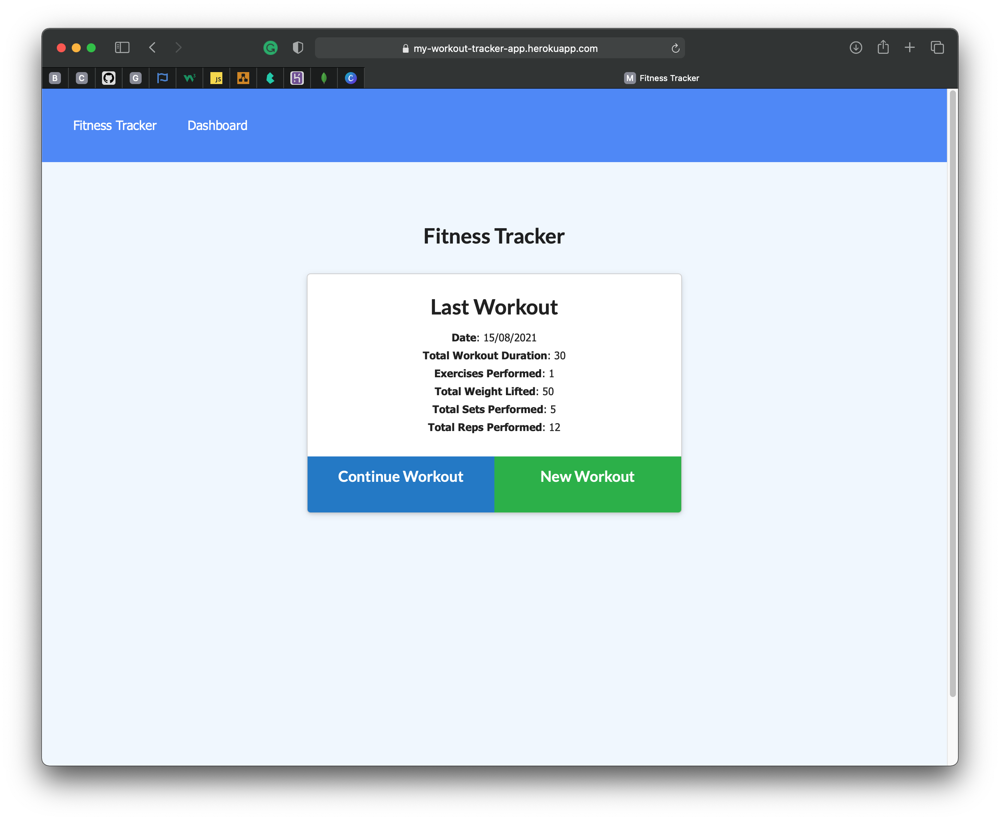
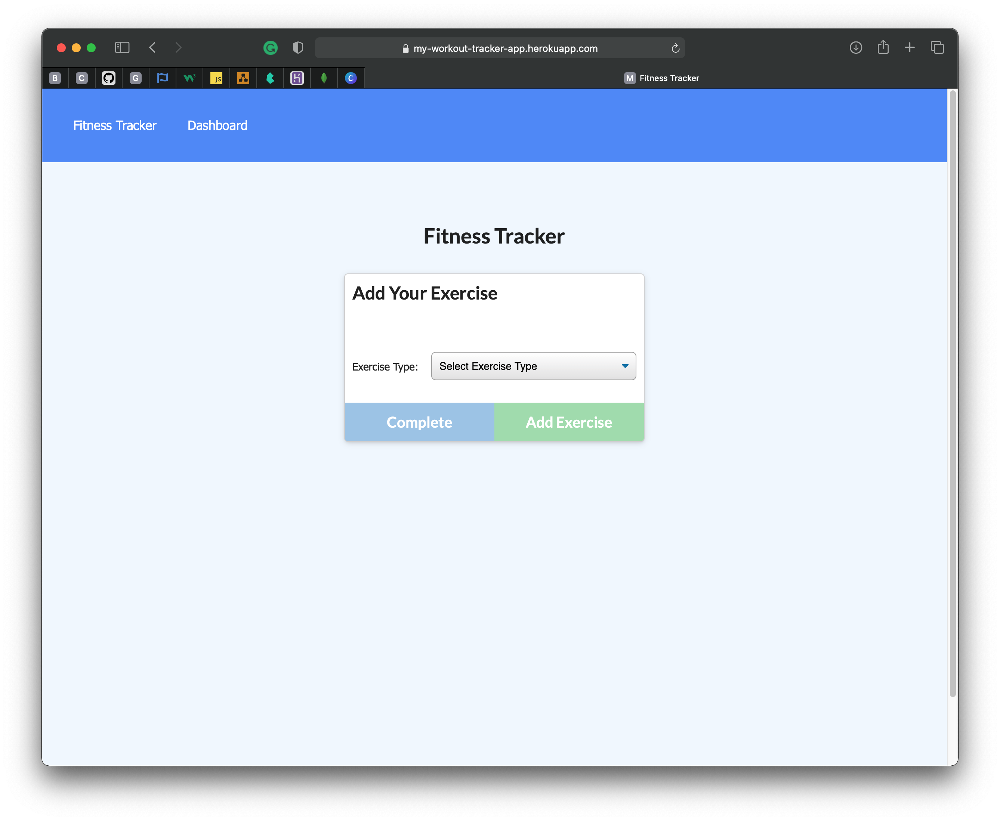
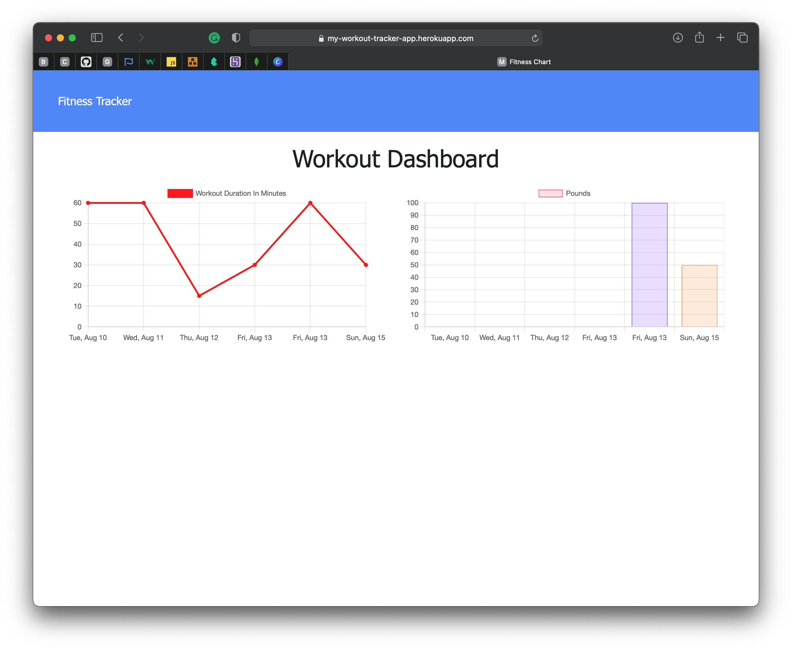

  
Table of Contents

  <ol>
    <li><a href="#description">Description</a></li>
    <li><a href="#live-url">Live URL</a></li>
    <li><a href="#features">Features</a></li>
    <li><a href="#technical-part">Technical Part</a>
        <ul>
            <li><a href="#demo">Demo</a></li>
            <li><a href="#installation">Installation</a></li>
            <li><a href="#usage">Usage</a></li>
            <li><a href="#contributing">Contributing</a></li>
        </ul>
    </li>
    <li><a href="#questions">Questions</a></li>
    <li><a href="#license">License</a></li>
    <li><a href="#notes">Notes</a></li>
  </ol>

## Description
**Workout Tracker** allows users to create, view and track daily workouts.
The user is able to track the name, type, weight, sets, reps and duration of resistance exercises and cardio exercises show the distance traveled in miles.
## Live URL

https://my-workout-tracker-app.herokuapp.com/

## Features

- JavaScript
- Node.js
- Express.js
- MongoDB
- npm

## Technical Part

### _Demo_

The screenshots below show the website previews:

### _Installation_

1. Download or clone repository.
2. [**Node.js**](https://nodejs.org/en/about/) and [**MongoDB**](https://www.mongodb.com/try/download/community) are required to run the application.
3. Run `npm install` in the Terminal to install the required npm packages

### _Usage_

- To start using the application, input the following in your Terminal

  `npm start`

- Navigate to `http://localhost:3001/` in your browser to see the client

- Enjoy!

### _Contributing_

Pull requests are welcome. For major changes, please open an issue first to discuss what you would like to change, so I learn and understand it better.

Please make sure to update tests as appropriate, if applicable.

## Questions

- Checkout my [GitHub profile](https://github.com/KorolyovaLara)
- Any additional questions or feedback, feel free to [send an email](mailto:larakorolyova@gmail.com).

## License

Copyright (c) [Larysa Korolyova](https://www.linkedin.com/in/korolyova/). All rights reserved.

Licensed under the [MIT](https://github.com/KorolyovaLara/Workout-Tracker/blob/main/LICENSE) license.

---

### Notes

Quote that recently inspired me:

> No excuses. Just do the work. -_Shalane Flanagan_

---

© 2021 L Korolyova